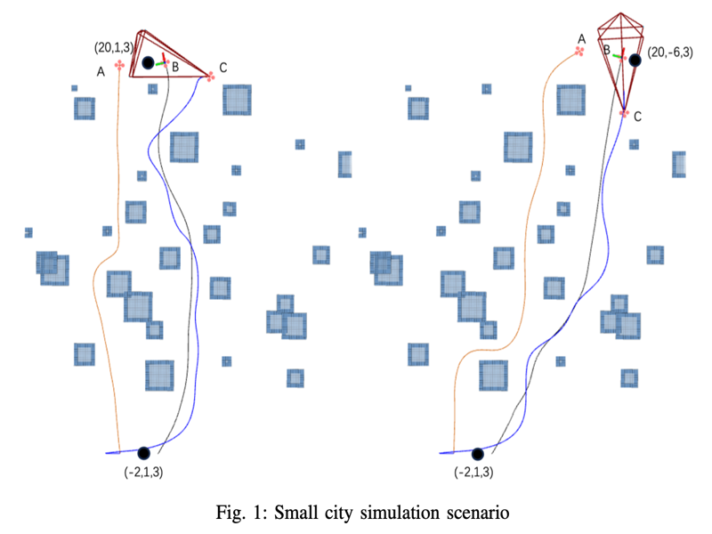
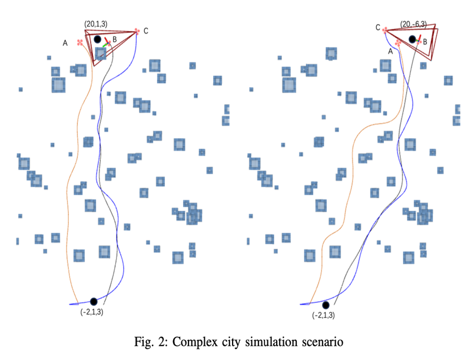

# TBLDS-UAV

## Urban Scenarios

<p align="center">
  
  
</p>

The results presented in Fig.1 and Fig.2 demonstrate the effectiveness of our algorithm in maintaining LoS communication between UAVs under different simulated scenarios.

In the simpler scenario depicted in Fig.1, UAVs B and C successfully maintained stable LoS communication. In contrast, in the more complex scenario shown in Fig.2, despite greater environmental challenges, the UAVs still maintained highly reliable LoS communication.

These results highlight the robustness of our LoS-optimized spatiotemporal persistence approach, which significantly outperforms scenarios lacking LoS constraints, where UAVs frequently lose communication opportunities.

To facilitate demonstration, we have also provided real-time flight GIFs of the UAVs: one corresponding to the 2D animation on the left side of Fig.1, and the other to the scene on the right side of Fig.2.

<p align="center">
  
  
</p>


## Reference

This UAV control algorithm is based on the work of J. Yu, J. Wu, and H. Jiang, “Spatio-Temporal Trajectory Design for UAVs: Enhancing URLLC and LoS Transmission in Communications,” IEEE Wireless Commun. Lett., pp. 1–1, 2024.

## About

If our repo helps your academic projects, please cite our paper. Thank you!

```bibtex
@article{yuSpatioTemporalTrajectoryDesign2024b,
  title = {Spatio-Temporal Trajectory Design for UAVs: Enhancing URLLC and LoS Transmission in Communications},
  shorttitle = {Spatio-Temporal Trajectory Design for UAVs},
  author = {Yu, Jingxiang and Wu, Juntao and Jiang, Hong},
  year = {2024},
  journal = {IEEE Wireless Communications Letters},
  pages = {1--1},
  issn = {2162-2337, 2162-2345},
  doi = {10.1109/LWC.2024.3416742},
  urldate = {2024-07-11},
  copyright = {https://ieeexplore.ieee.org/Xplorehelp/downloads/license-information/IEEE.html},
  langid = {english}
}
